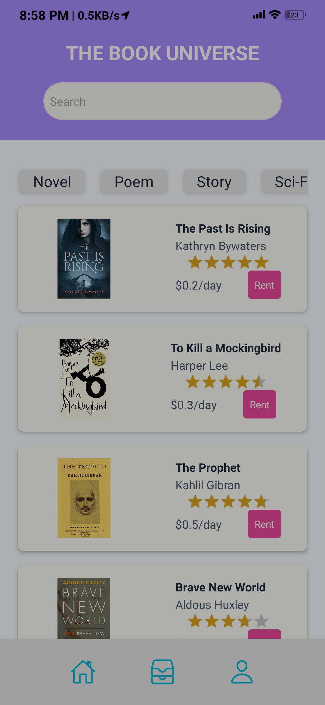
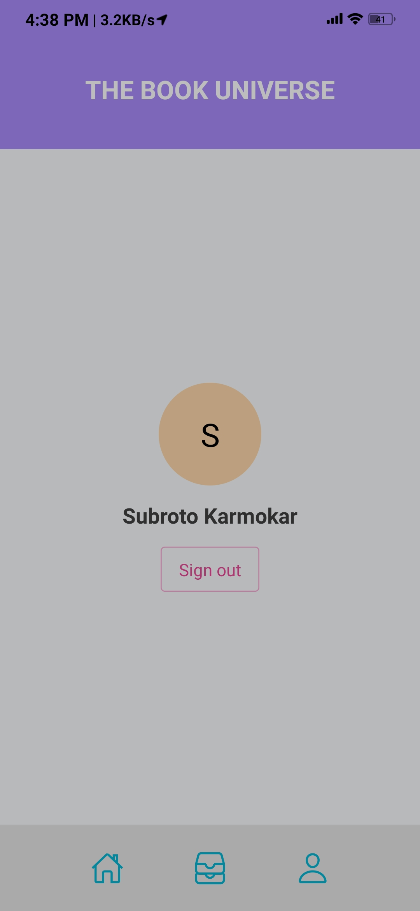
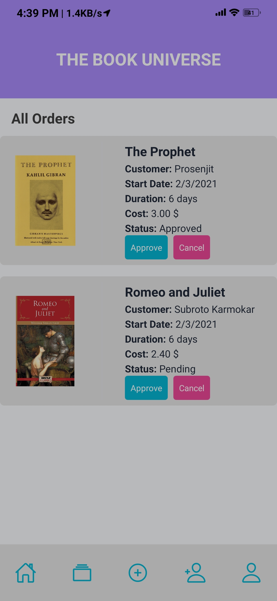
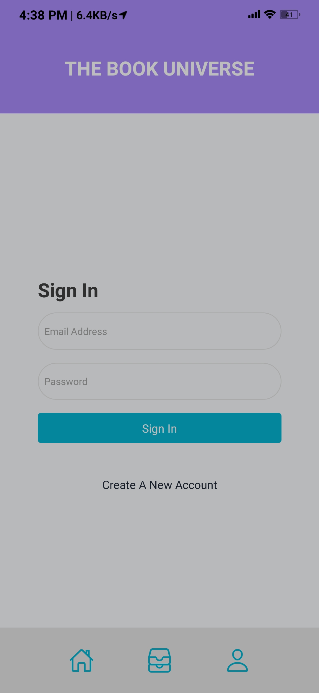
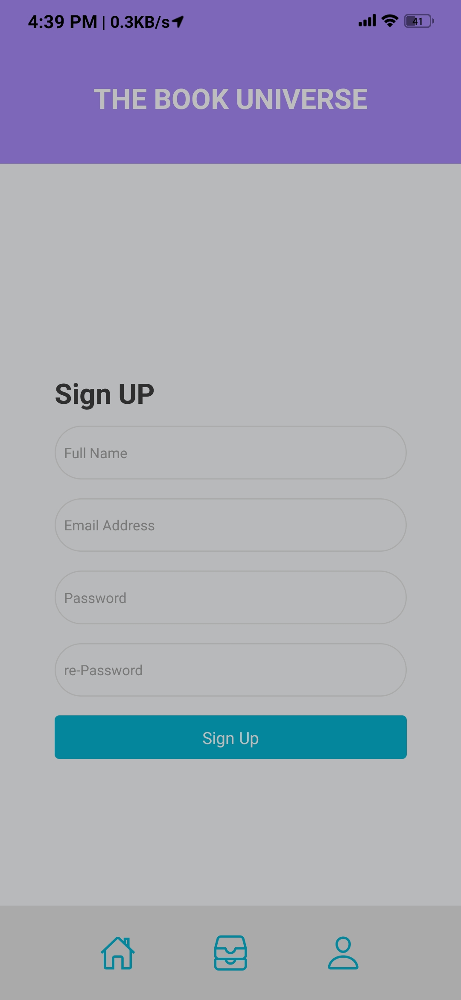

# Book Universe

That is backend code. Technology use: React Native, Expo, Firebase, Native Base.

### About this project

- This application has two types of uses (customer and admin)
- Customers can see all booklists.
- Among the list, users can choose a book for rent.
- They need to fill the form with the information of start date, end date, and location.
- The total cost will be calculated based on the duration of the rent.
- Admin can approve from the order list.
- For any kind of operation, every user needs to log in
- Users can also create new accounts.
- Admin can add new book and add new admin(coming soon…).

<h2 align="center">Screenshots</h2>

    
    
    
    
    
    
    

